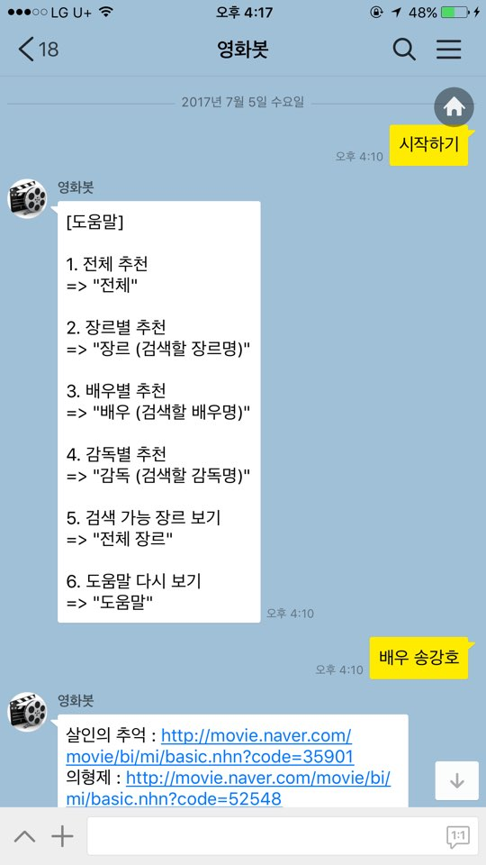

# MovieBot
카카오톡 영화봇

## 사용법
1. 카카오톡에서 **영화봇** 을 검색해주세요.
2. **영화봇** 을 클릭하여 1:1 채팅을 시작한다.

## 시연 영상

https://www.youtube.com/watch?v=GzBHi2QZcQI&feature=youtu.be

## 주의사항
비용을 지불하지 않기 위해 동아리(**경북대학교 GNB 동아리**) 컴퓨터로 서버를 운영하고 있고, 불의의 사고(?)로 컴퓨터가 종료될 시 응답을 받지 못할 수 도 있습니다.

## 문의사항
기타 궁금한 점이나 요구사항은 아래의 **이메일** 또는 **issue**를 통해서 문의주시면 감사드리겠습니다.

- tmdghks584@gmail.com
- https://github.com/jupiny/MovieBot/issues